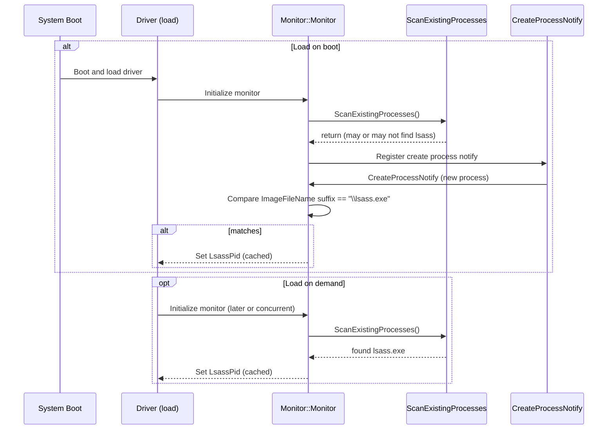

# ProcessMonitor — lsass.exe detection flows

This document shows two optional flows (sequence diagram) that describe how `Process::Monitor` can obtain the `lsass.exe` PID (`LsassPid`).

- Option 1 (boot path): system boots -> driver loads -> monitor queries existing processes -> monitor registers create-notify -> create notification arrives -> monitor detects lsass and caches PID.
- Option 2 (load-only): driver loads -> monitor queries existing processes and finds lsass immediately -> monitor caches PID.

`LsassPid` is a global `ULONG` used to speed up hot-path checks (for example in the OB pre-op callback) and avoid repeated image name resolution.

---

## Sequence diagram (mermaid)

---

## Notes

- Option 1 covers the case where the system boots and the create-notify event for lsass occurs after the monitor has registered callbacks.
- Option 2 covers the case where `ScanExistingProcesses()` discovers lsass during initialization and the PID is cached immediately.
- Caching `LsassPid` avoids expensive image path resolution in hot callbacks (OB pre-op) and enables fast PID comparisons.

If you want I can extend the diagram to show OB pre-op handle creation checks and the subsequent event emission to the worker/queue.
