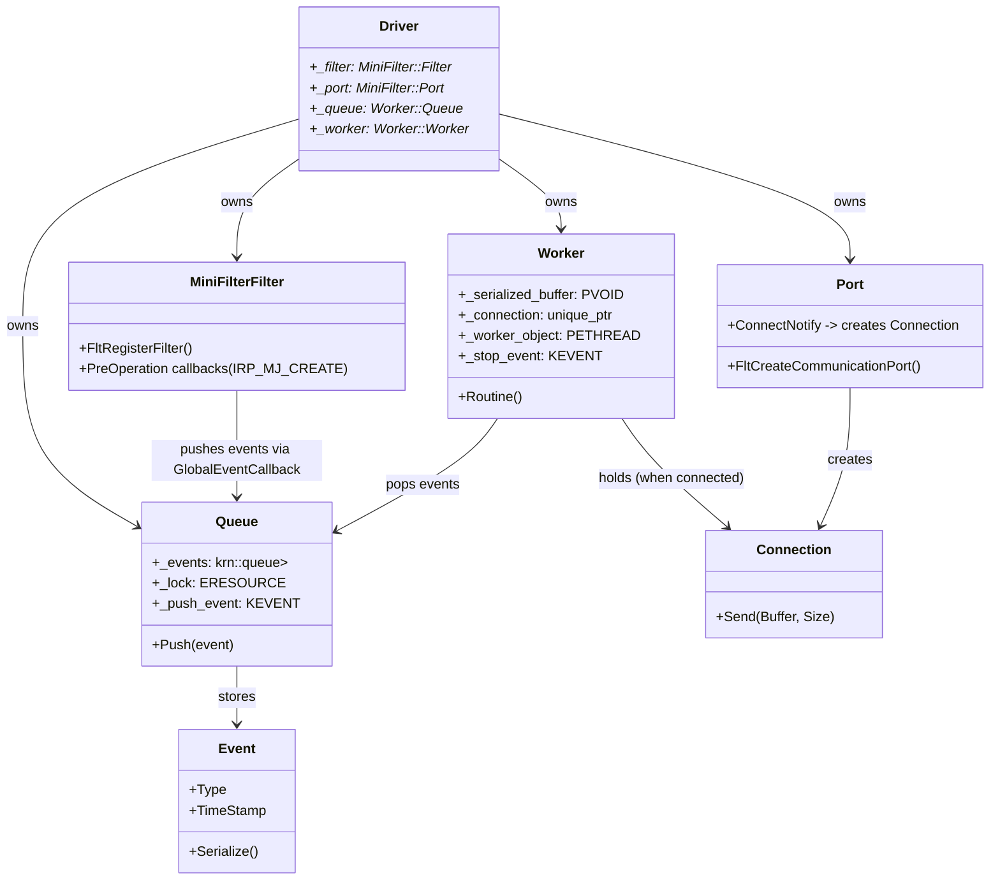
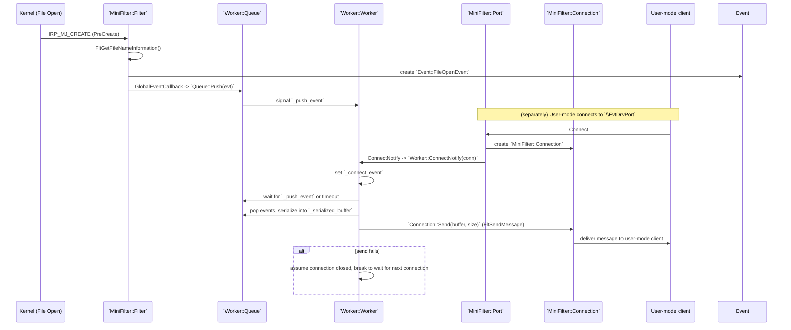

# EvtDrv — Filter Driver Utilities

This document summarizes the purpose of the `EvtDrv` component and lists coding rules and conventions followed across the source code.

## Purpose

`EvtDrv` implements a kernel-mode filter driver worker component responsible for collecting events (for example, file open events), serializing them and forwarding them to a user-mode client over a connection.

## Document Structure

This section describes the component structure and the main control flow of `EvtDrv` (a minifilter + worker) in a concise text form with accompanying `mermaid` diagrams.

Short overview:
- `DriverEntry` (defined in `Entry.cpp`) initializes and manages a `Driver` object that is responsible for creating and owning:
  - `Queue` (`Worker::Queue`) — a kernel event queue holding `Event::Event` instances (for example, `Event::FileOpenEvent`).
  - `Worker` (`Worker::Worker`) — a kernel thread that batches, serializes and sends events to a user-mode client when a `Connection` is available.
  - `MiniFilter::Filter` — registers minifilter callbacks (e.g., for `IRP_MJ_CREATE`) and installs a `GlobalEventCallback` to forward events into the `Queue`.
  - `MiniFilter::Port` — a communication port used by user-mode applications to connect; a `MiniFilter::Connection` object is created per client connection.

Main components and their relationships (structure diagram):

Primary runtime sequence when a file open occurs and a user-mode client is connected:

## Ideas & Decisions Log

### Minifilter Object Management: Comparison of Approaches

| Feature | Global / Static Variable | Filter Context (FltMgr) |
| :--- | :--- | :--- |
| **Performance** | **Extremely Fast (O(1))**: Direct memory access with zero computational overhead. | **Moderate**: Involves lookup overhead and Reference Counting (Atomic Inc/Dec). |
| **Encapsulation** | **Low**: Can lead to "spaghetti code" and makes unit testing or modularity difficult. | **High**: Follows the Minifilter Framework architecture and promotes clean OOP design. |
| **Safety** | **Manual**: Developer must manually handle initialization, destruction, and synchronization. | **Automatic**: The framework manages the lifecycle (Cleanup/Delete) via registered callbacks. |
| **Scalability** | **Poor**: Difficult to manage if the driver needs to handle multiple filter instances independently. | **Excellent**: Easily maps specific objects to corresponding Filter, Instance, or Volume handles. |

**Decision:** This project utilizes a **Global Static Singleton** pattern for object management to eliminate lookup overhead and maximize I/O throughput in high-performance scenarios.

