# Rules DSL — Định nghĩa yêu cầu chức năng

Rút ra từ [sample.rules](sample.rules). Tài liệu này định nghĩa các thành phần cú pháp và hành vi mà một engine xử lý file `.rules` phải hỗ trợ.

| ID | Thành phần | Cú pháp | Yêu cầu chức năng | Ví dụ |
|----|------------|---------|--------------------|-------|
| R1 | Khối pattern | `pattern <name> [thuộc_tính...]` ... `end` | Mỗi file có thể chứa nhiều khối `pattern`, mỗi khối có tên định danh duy nhất và phải được đóng bằng từ khóa `end` | `pattern drop_and_run` ... `end` |
| R2 | Thuộc tính scope | `scope=<value>` (đặt trên dòng khai báo `pattern`) | Xác định phạm vi tương quan giữa các step trong pattern (ví dụ: chỉ đối chiếu các step phát sinh từ cùng actor liên quan) | `scope=related_actors` |
| R3 | Khai báo step | `step <label> op=<operation> [điều_kiện...]` | Mỗi step trong pattern có một nhãn (label) duy nhất trong phạm vi pattern và một `op` chỉ định loại sự kiện/hành động cần khớp | `step drop op=file_create ...` |
| R4 | Trình tự step | Nhiều `step` liệt kê tuần tự trong 1 pattern | Các step được đánh giá/khớp theo đúng thứ tự khai báo, thể hiện một chuỗi hành vi (sequence) cần phát hiện | `step drop ...` rồi `step exec ...` |
| R5 | Điều kiện trường dữ liệu | `<field>=<value>` hoặc `<field.attr>=<value>` | Mỗi điều kiện so khớp giá trị của một attr thuộc trường sự kiện; truy cập attr bằng dấu chấm (`path` chỉ là một attr trong số nhiều attr có thể có, ví dụ `image.path`, `image.hash`...) | `image.path="lsass.exe"` |
| R6 | Toán tử so khớp chính xác | `=` | So khớp giá trị trường bằng chuỗi chính xác | `image.path="lsass.exe"` |
| R7 | Toán tử so khớp wildcard | `~~` | So khớp giá trị trường theo mẫu glob/wildcard (hỗ trợ `*`) | `image.path~~"*.exe"` |
| R8 | Toán tử so khớp chứa | `~` | So khớp giá trị trường khi chuỗi con nằm trong (substring/contains), không cần glob | `image.path~"System32"` |
| R9 | Toán tử so khớp regex | `=~` | So khớp giá trị trường theo biểu thức chính quy (regex) | `image.path=~"^C:\\\\Windows\\\\.*\\.exe$"` |
| R10 | Tham chiếu giá trị step trước | `$<step_label>.<field>` | Điều kiện của một step có thể tham chiếu tới giá trị trường của step khác đã khai báo trước đó trong cùng pattern, dùng để liên kết dữ liệu giữa các bước | `image=$drop.image` |
| R11 | Không điều kiện trường bắt buộc | `step <label> op=<operation>` (không kèm điều kiện) | Một step hợp lệ khi chỉ cần khớp đúng loại `op`, không bắt buộc phải có điều kiện trường | `step dump op=file_create` |
| R12 | Chuỗi có dấu ngoặc kép | `"<value>"` | Giá trị so khớp (chính xác, wildcard, chứa, hoặc regex) được đặt trong dấu ngoặc kép | `"*.exe"`, `"lsass.exe"` |
| R13 | Toán tử AND ngầm định | (khoảng trắng giữa 2 điều kiện, không viết gì) | Nhiều điều kiện liệt kê liên tiếp trên 1 dòng `step` mà không có từ khoá xen giữa mặc định là AND — step chỉ thoả khi **tất cả** các điều kiện đó cùng đúng | `key_path~~"A" value_name="B"` |
| R14 | Toán tử AND/OR tường minh | `and`, `or` (từ khoá, phân biệt hoa/thường) | Xen giữa 2 điều kiện để nối rõ ràng; `and` ưu tiên cao hơn `or` (giống hầu hết ngôn ngữ) — biểu thức được diễn giải dạng DNF: `a and b or c and d` = `(a AND b) OR (c AND d)`. Không viết từ khoá giữa 2 điều kiện tương đương `and` (xem R13) | `key_path~~"A" and value_name="B" or key_path~~"C"` |

## Ghi chú

- Bảng trên chỉ dựa trên các cấu trúc xuất hiện trong `sample.rules`; chưa có spec chính thức nào khác trong thư mục dự án.
- R8 (`~`) và R9 (`=~`) là toán tử bổ sung theo yêu cầu, chưa xuất hiện thực tế trong `sample.rules` — cần thống nhất thêm về độ ưu tiên/escape khi kết hợp với `~~` và `=`.
- Danh sách `op` hiện quan sát được: `file_create`, `process_create`, `process_open`. Chưa rõ danh sách đầy đủ các `op` được hỗ trợ.
- Chưa rõ các giá trị `scope` khác ngoài `related_actors`, và hành vi mặc định khi không khai báo `scope`.

# Thuật toán: compile, filter, và tìm pattern khớp event

Mục này mô tả 3 thuật toán lõi đang chạy thật (đã build + test trên host, không phải thiết kế trên
giấy) — tương ứng đúng 3 crate trong [BUILD.md](BUILD.md): `kfilter-compiler` (compile),
`kfilter-lib` (filter), và tầng đánh giá trong `kfilter-cli` (tìm pattern khớp event).

```mermaid
flowchart LR
    R[".rules"] -->|"1. parse -> DNF groups"| S["Step { line, op, groups: Vec&lt;Vec&lt;Condition&gt;&gt; }"]
    S -->|"2. compile_condition\ngroup by (op,field)"| P["N nhóm pattern,\n1 nhóm/mỗi (op,field)"]
    P -->|"3. dense::Builder\nMatchKind::All, 1 DFA/nhóm"| D["N dense DFA"]
    D -->|"4. to_sparse mỗi DFA"| SP["N sparse DFA bytes"]
    SP -->|"5. BFS toàn bộ state, mỗi DFA"| M["entries[i].state_map:\nstate_id -> Vec&lt;(line,group)&gt;"]
    SP -->|"6. serialize_entries -> 1 blob"| WIRE["kfilter_rules.dfa\n(đóng gói N DFA)"]
    WIRE -->|gửi qua IOCTL / load trực tiếp| RT["kfilter_load: parse blob\n-> entries: [Ruleset; N]\n(kfilter-lib)"]
    EV["event: op + field=value..."] -->|"per field: tra (op,field) -> entry"| MS["entries[i].match_state\n(kfilter-lib)"]
    RT --> MS
    MS -->|"StateID (u32)"| LK["tra state_id trong entries[i].state_map"]
    LK -->|"hits: (line,group) -> field đã khớp"| HIT["gom theo group"]
    HIT -->|"so với field group yêu cầu"| OK["step nào thực sự thoả (AND/OR)"]
```



## 1. Compile: `.rules` → N DFA (1 cho mỗi (op, field)) + bảng tra state

Nằm ở `kfilter-compiler/src/lib.rs` (`parse_rules` + `compile_ruleset`).

### 1.1. Parse thành DNF (`parse_conditions`)

Quét ký tự trên dòng `step` sau `op=<op>`, xây `Vec<Vec<Condition>>` — mỗi phần tử ngoài là 1
**OR-group**, mỗi phần tử trong là các `Condition` được **AND** với nhau:

```
groups = [[]]                       # bắt đầu với 1 group rỗng
với mỗi token trong dòng:
    nếu token == "or"  (đứng riêng)  -> groups.push([])         # mở group mới
    nếu token == "and" (đứng riêng)  -> bỏ qua (đã AND ngầm định)
    ngược lại: parse "<field><op>"<value>"" -> groups.cuối.push(condition)
```

`and` ưu tiên cao hơn `or` do cách này: chỉ `or` mới mở group mới, mọi condition khác cứ nối tiếp
vào group hiện tại — nên `a and b or c and d` tự nhiên tách thành `[[a,b],[c,d]]` mà không cần
bảng ưu tiên toán tử tường minh.

### 1.2. Compile 1 điều kiện → regex (`compile_condition`)

| Toán tử DSL | Hàm | Biến đổi |
|---|---|---|
| `=` | `exact_to_regex` | escape toàn bộ, bọc `^...$` |
| `~~` | `glob_to_regex` | `*`→`.*`, `?`→`.`, còn lại escape, bọc `^...$` |
| `~` | `contains_to_regex` | escape toàn bộ, **không** bọc neo → khớp substring |
| `=~` | (passthrough) | giữ nguyên, coi giá trị đã là regex |

Escape dùng chung 1 tập ký tự đặc biệt regex (`\.+*?()|[]{}^$`) — kể cả `\` (để `\\` trong `.rules`
thành literal `\` rồi escape lại đúng thành `\\` trong regex, xử lý đúng path Windows có backslash).

### 1.3. Gom theo (op, field), build 1 DFA riêng cho mỗi nhóm

```
groups: Map<(op, field), Vec<pattern>> = {}
với mỗi step, mỗi (group_idx, group) trong step.groups, mỗi cond trong group:
    groups[(step.op, cond.field)].push(compile_condition(cond))

với mỗi ((op, field), patterns) trong groups:
    dfa = dense::Builder::new()
        .configure(...match_kind(MatchKind::All))
        .build_many(&patterns)
    sparse = dfa.to_sparse()
    entries.push(RulesetEntry{op, field, dfa_bytes: sparse, state_map: ...})   # xem 1.4
```

Mỗi `(op, field)` có DFA riêng — không dùng 1 DFA phẳng chung cho mọi field. `MatchKind::All` vẫn
bắt buộc cho mỗi DFA (mặc định `LeftmostFirst` chỉ giữ 1 pattern "thắng" mỗi state, xoá mất thông
tin cần cho bước 1.4).

**Đo thật trên `registry_mitre.rules`** (250 pattern, gom thành 3 nhóm: `key_path`, `value_name`,
`value_data`, đều `op=registry_set`): tách theo (op,field) cho **DFA nhỏ hơn** (162,225 so với
390,956 bytes nếu gộp chung 1 DFA — giảm 58.5%), **build nhanh hơn** (29.8ms so với 241.7ms — nhanh
~8x), và **match nhanh hơn** (331ns so với 441ns/lần gọi — nhanh ~25%). Không phải đánh đổi hiệu
năng lấy độ đơn giản — tách ra thắng ở cả 3 mặt, vì 1 DFA gộp chung phải giữ thêm state chỉ để
phân biệt tổ hợp pattern giữa các field không liên quan, việc không bao giờ thực sự cần thiết
(1 field chỉ bao giờ đem test với pattern của đúng field đó).

### 1.4. Xây bảng `state_id -> (line, group)` cho từng entry (BFS, `build_state_line_map`)

Chạy **riêng cho mỗi DFA** (không phải 1 lần cho cả ruleset):

```
seen = {start}; queue = [start]
while queue không rỗng:
    state = queue.pop()
    nếu state không phải dead-state:
        với mỗi byte b trong 0..=255:
            next = dfa.next_state(state, b)
            nếu next chưa thấy: seen.add(next); queue.push(next)

    eoi = dfa.next_eoi_state(state)      # mô phỏng đúng bước "hết chuỗi" mà match_state sẽ làm
    nếu dfa.is_match_state(eoi):
        owned = { (line, group) của mọi pattern_id mà
                  dfa.match_pattern(eoi, i) cho i in 0..dfa.match_len(eoi) }
        map[eoi] = dedup(owned)
```

Không cần giữ `op`/`field` trong bảng — DFA của entry đã tự scope đúng 1 `(op,field)` rồi, chỉ cần
`(line, group)`. Đây là duyệt đồ thị trạng thái đầy đủ của 1 DFA (không
phải duyệt theo chuỗi input), chạy 1 lần lúc compile. Bảng này **chỉ dùng ở user-mode**
(`kfilter-cli` hiện tại, hoặc sau này là tầng đọc log từ driver) — kernel không giữ nó, chỉ giữ DFA
bytes. `op`/`field` là enum `#[repr(u32)]` (`Op`/`Field`, vocabulary đóng, không phải chuỗi tuỳ ý) —
mọi entry được đóng gói thành 1 blob qua `serialize_entries`:
`[magic][version][entry_count]` rồi lặp `[op: u32][field: u32][dfa_len: u32][dfa bytes]`.

## 2. Filter: 1 giá trị field → `StateID` (`Ruleset::match_state`, `kfilter-lib/src/lib.rs`)

Đây là phần chạy trong kernel (khi bật feature `kernel`) lẫn trong `kfilter-cli` (khi không bật) —
**cùng 1 đoạn code**, không phải 2 cài đặt khác nhau. Việc tách theo (op,field) chỉ ảnh hưởng tới
việc **chọn DFA nào** để gọi hàm này (xem bên dưới), không ảnh hưởng tới bản thân hàm:

```
state = dfa.start_state_forward(haystack)
với mỗi byte b trong haystack:
    state = dfa.next_state(state, b)
    nếu dfa.is_dead_state(state): break     # thoát sớm, không lãng phí quét hết chuỗi
state = dfa.next_eoi_state(state)           # bước "kết thúc chuỗi" — pattern đều neo ^...$
nếu dfa.is_match_state(state): trả state.as_u32()
ngược lại: trả None
```

Đặc điểm cố ý: **không** enumerate ra danh sách pattern/line khớp ở đây — chỉ trả về đúng 1 số
nguyên (`StateID`). Độ phức tạp O(độ dài haystack) thời gian, **O(1) tuyệt đối** bộ nhớ (không mảng,
không heap, không cap cần tinh chỉnh) — bất kể ruleset có bao nhiêu pattern. Việc "state này ứng
với (những) pattern/line nào" hoàn toàn nằm ở bảng đã build sẵn tại bước 1.4 (**của đúng entry đang
dùng**), tra ở tầng gọi bên ngoài (mục 3), không phải việc của hàm này.

Trong kernel (`kfilter-lib` feature `kernel`), `kfilter_match` nhận thêm 1 mảng `entries` cố định
kích thước `OP_COUNT * MAX_FIELDS_PER_OP` slot (do C++ cấp phát đúng `kfilter_data_size()` byte —
1 con số "mờ", không biết số slot hay kích thước 1 slot riêng — rồi `kfilter-lib` tự parse nguyên
blob IOCTL và điền qua `kfilter_install_from_blob`; driver không cần biết layout của blob lẫn của
`entries`). Chọn đúng
slot bằng 1 phép tính chỉ số trực tiếp — `index = op * MAX_FIELDS_PER_OP + field_index(op, field)`
(`field_index` = vị trí của field trong danh sách field riêng của op đó, xem [BUILD.md](BUILD.md)
mục "Lookup (op, field)") — **O(1) thật, không quét mảng**, trước khi gọi `match_state`. Hàm này
**hoàn toàn không cấp phát bộ nhớ, không giữ lock nào** — nó tin tưởng rằng bộ nhớ `entries` trỏ
tới còn hợp lệ suốt lúc gọi. Việc đảm bảo điều đó (cấp phát, và đồng bộ để không free trong lúc còn
ai đang match) là trách nhiệm tường minh của `Driver.cpp`, dùng `EX_RUNDOWN_REF` (primitive có sẵn
trong kernel) — xem [BUILD.md](BUILD.md) mục "Quản lý tài nguyên ở Driver.cpp".

## 3. Tìm pattern/step khớp 1 event (`kfilter-cli/src/main.rs`, hàm `main`)

Input: 1 event có cấu trúc `op=<op> field1="v1" field2="v2" ...` (xem [BUILD.md](BUILD.md) mục
`kfilter-cli`). Vì mỗi entry đã tự scope đúng 1 `(op,field)` (mục 1.3), **không cần lọc `op`/`field`
sau khi match** — DFA của entry không có cách nào trả về kết quả thuộc field khác, vì nó chưa từng
thấy pattern của field khác:

```
hits: Map<(line, group), Set<field_name>> = {}

với mỗi (field_name, value) trong event.fields:
    entry_idx = entry_index[(event.op, field_name)]      # tra 1 lần, O(1) (HashMap)
    nếu không có entry cho (op, field_name): tiếp tục field kế
    state = entries[entry_idx].ruleset.match_state(value)   # mục 2, gọi 1 lần/field
    nếu state là None: tiếp tục field kế
    owned = entries[entry_idx].state_map[state]              # tra bảng bước 1.4 của ĐÚNG entry đó
    với mỗi (line, group) trong owned:
        hits[(line, group)].add(field_name)

với mỗi (line, group), hit_fields trong hits:
    required = { c.field cho c trong steps[line].groups[group] }   # từ Step gốc, không qua DFA
    nếu required ⊆ hit_fields:
        # group này đã đủ AND -> step tại (line, group) THOẢ
        báo "line (pattern.step, group)"

step tổng thể thoả nếu CÓ ÍT NHẤT 1 group thoả (đúng ngữ nghĩa OR giữa các group)
```

Việc "field nào được phép sinh ra kết quả nào" nằm sẵn trong cấu trúc DFA (mục 1.3), không cần
kiểm tra lại ở tầng đánh giá. Đã verify thật: sự kiện `key_path="C:\this\is\not\a\registry\key"`
báo đúng "không thoả rule nào" (không bị khớp nhầm sang rule của field khác).

**Độ phức tạp**: với K field trên 1 event, tổng chi phí ≈ K lần tra `entry_index` (O(1)) + K lần
gọi `match_state` (mục 2, O(độ dài giá trị field) mỗi lần — mục 1.3) + so sánh tập hợp nhỏ (số
`(line,group)` mỗi state thường vài chục, không tỉ lệ theo tổng số rule trong ruleset). Không phụ
thuộc độ phức tạp biểu thức AND/OR của rule — chỉ phụ thuộc số field khác nhau mà các rule liên
quan đang kiểm tra.
