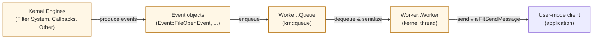

# FilterDriver Solution Overview

This repository contains a kernel-mode filter driver solution. The primary project in this workspace is `EvtDrv`, a minifilter-based kernel component that captures file open events, serializes them and forwards them to a user-mode client via a communication port.

---

## Solution overview

The solution contains a single driver project `EvtDrv/` and a set of kernel-friendly utility headers under `EvtDrv/Utilities/`.

Key source files and responsibilities:
- `Entry.cpp` / `Driver` — driver initialization, lifetime management and ownership of core objects.
- `MiniFilter.cpp` / `MiniFilter.hpp` — minifilter registration, pre-op callbacks (e.g., `IRP_MJ_CREATE`), and communication port creation (`FltCreateCommunicationPort`).
- `Worker.cpp` / `Worker.hpp` — kernel worker thread that batches, serializes and sends events to a user-mode client via `FltSendMessage`.
- `Event.hpp` — event object types and serialization logic.
- `Utilities/` — lightweight containers and helpers (e.g., `queue.hpp`, `list.hpp`, `mutex.hpp`, `krn.hpp`).

---

## Runtime data path

1. A file-open occurs and the minifilter pre-operation (`IRP_MJ_CREATE`) callback executes.
2. The minifilter collects file information, constructs an `Event::FileOpenEvent` and calls the global event callback.
3. The global callback pushes the event into `Worker::Queue` and signals the worker thread.
4. `Worker::Worker` pops events, serializes them into a fixed buffer and sends them to the connected user-mode client via `MiniFilter::Connection` (`FltSendMessage`).

---

## Solution-level architecture (mermaid)

---

Build & test notes
- Requires Visual Studio + Windows Driver Kit (WDK).
- Build configurations are in the `EvtDrv` project files. Test in a VM with test-signing enabled.

Tested platforms
- Windows 11 (verified in a test VM)

For component-level diagrams and sequence flows see `EvtDrv/readme.md`.

# TODO

- Add more event types:
    - File Creation
    - File Modification
    - File Deletion
    - File Rename
    - File Linking
    - Registry Key Creation
    - Registry Key Deletion
    - Registry Value Creation
    - Registry Value Deletion
    - Registry Value Modification
    - ~~Process Creation~~
    - ~~Process Exit~~
    - ~~Process Open~~
    - Image Load
    - Network Connection
    - ~~Remote Thread Creation~~
    - Access Token Acquisition

- Implement authentication for user-mode clients connecting to the communication port.
- Implement authentication for unloading the driver
- Implement authentication events mechanism (e.g., only send events for specific processes or file paths).
- Improve event data
    - Remote thread: start function, thread parameters, etc.