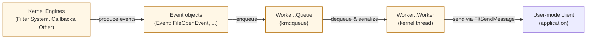

# FilterDriver Solution Overview

This repository contains a kernel-mode filter driver solution. The primary project in this workspace is `EvtDrv`, a minifilter-based kernel component that captures file open events, serializes them and forwards them to a user-mode client via a communication port.

---

# Solution-level architecture (mermaid)

---

# Event Implementation Tracking

| Event | Implement Status | Fields | Note |
| :--- | :---: | :--- | :--- |
| **File Creation** | ⌛ In Progress | | |
| **File Modification** | ❌ Not Started | | |
| **File Deletion** | ❌ Not Started | | |
| **File Rename** | ❌ Not Started | | |
| **File Linking** | ❌ Not Started | | |
| **Registry Key Creation** | ❌ Not Started | | |
| **Registry Key Deletion** | ❌ Not Started | | |
| **Registry Value Creation** | ❌ Not Started | | |
| **Registry Value Deletion** | ❌ Not Started | | |
| **Registry Value Modification** | ❌ Not Started | | |
| **Process Creation** | ✅ Done | <ul><li>ProcessId</li><li>TargetProcessId</li><li>Image</li><li>CommandLine</li></ul> | |
| **Process Exit** | ✅ Done | <ul><li>ProcessId</li><li>ProcessCreationTime</li></ul> | |
| **Process Open** | ✅ Done | <ul><li>ProcessId</li><li>TargetProcessId</li><li>DesiredAccess</li></ul> | |
| **Image Load** | ❌ Not Started | | |
| **Network Connection** | ❌ Not Started | | |
| **Remote Thread Creation** | ✅ Done | <ul><li>ProcessId</li><li>TargetProcessId</li><li>ThreadId</li></ul> | ⌛ Pending start function |
| **Access Token Acquisition** | ❌ Not Started | | |

---

Build & test notes
- Requires Visual Studio + Windows Driver Kit (WDK).
- Build configurations are in the `EvtDrv` project files. Test in a VM with test-signing enabled.

Tested platforms
- Windows 11 (verified in a test VM)

For component-level diagrams and sequence flows see `EvtDrv/readme.md`.

- Implement authentication for user-mode clients connecting to the communication port.
- Implement authentication for unloading the driver
- Implement authentication events mechanism (e.g., only send events for specific processes or file paths).
- Improve event data
    - Remote thread: start function, thread parameters, etc.